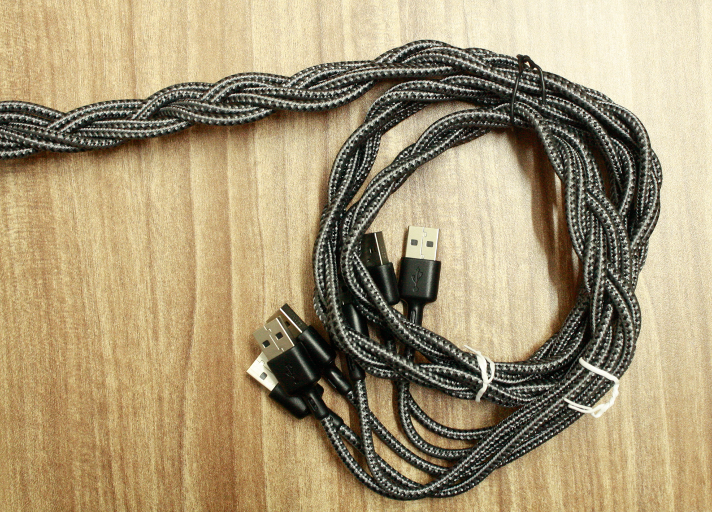

# Getting started with clustering 
## part 1:

### Introduction:
Its always has been my wish to build my own SBC cluster, and its finally a reality!

in this article I'll explain what were my steps to setup and build my own super powered SBC cluster

### Getting started:
to build a cluster we need to select our choice of processing media and various components to interconnect the system.

I chose the VIM3 as the brains of the operation/s


I've been using the VIM3 for about 2 years now, and these is nothing as fast that does wonders without breaking a sweat,

I'll be using the VIM3s in a 5+1 configuration where 1 VIM3 controls the other 5 VIM3s

the net resources in this cluster (excuding the master node) is:
```
30 cores
10 GB of RAM
80 GB of eMMC storage (70GB available after linux is installed)
```
this insane amount of resources will allow us to some intense things

`but what is a cluster without the literal fabric that connects it all ?`

### The essentials:

`The four horsemen of connecting it all`

the 4 main things we need for connecting it all together include:

1. TPlink 8 port gigabit ethernet switch
2. generic 6 port wall charger
3. Ethernet cables
4. USB-C cables

the gigabit ethernet switch is the literal bread and butter of the entire operation, allowing high speed communication between all the various nodes connected to it.

the charger is a branded version of the generic HDS-HDD10T charger, it provides 60w of power distributed among 6 individual USB ports, allowing us to power up the system without any power deficiency

the cables also play a vital role as they help to connect everything together
the USB cables were plain braided USB-C to USB-A and the ethernet cables were 1 meter long patch cables which were CAT6 compliant.

### Building the cluster:
except the master node, each node was fitted with a small heatsink to help dissipate heat, and was stacked with pairs of M2 standoffs


`putting it together piece by piece`

all such nodes were given standoffs and stacked up to finally give a tower of SBCs


`the tower of power`

the nodes are well spaced to allow for good airflow during passive cooling.

the top most node which is the master node which controls all the other nodes is fitted with a passive heatsink from khadas, and acts as the endcap for the standoff heads and also gives the extra necessary cooling for the master node which will have to manage all other devices

### setting up some initial software...
for the cluster we need to setup all the nodes to run linux, the simple approach I took to do this seamlessly is using [Krescue](https://docs.khadas.com/vim3/Krescue.html)

one node at a time can be fitted with a thumbdrive containing krescue and the necessary firmware file and connected to the computer to open up the krescue web console and flash the firmware


`look ma, krescue is on my browser!`

my choice of firmware was the stock ubuntu image running the mainline kernel, this would mean I'd be getting the up to date software and latest optimizations available.

### cable management:
much work was done to organize the extra lengthy cables I used here, if you were to attempt this you could get away with some smaller patch cables for less of a mess.

extensive usage of twist ties and braiding was done to maintain the seamless flow of the cables


`were these braided cables or cables braided? :S`

### what's next ?:
in the next part I'll be exploring some of the software I used to setup the cluster this includes things like passwordless SSH functionality, various software for running code with the power of all the clusters etc. 