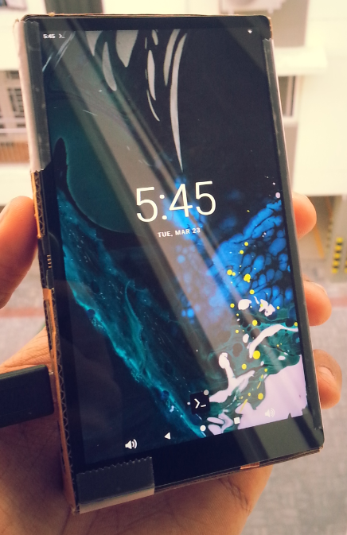
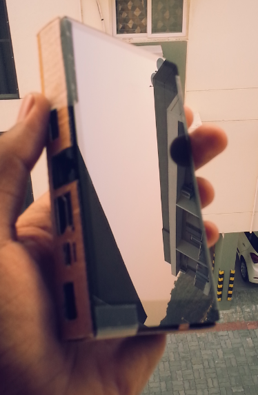
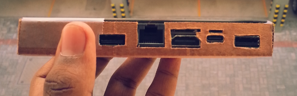
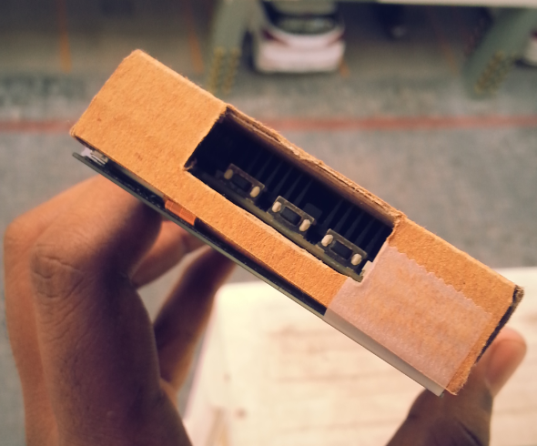
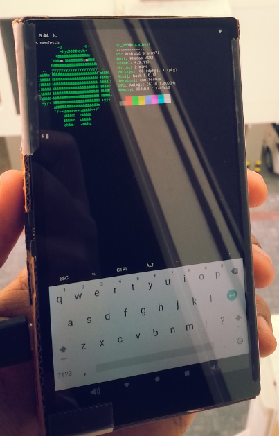

# The Kardboard
## a DIY tablet wrapped in a cardboard case:

The Kardboard is a simple yet deliberate project I bought out a while ago, and is now in its development stages.

the idea is to create a DIY tablet in a slim form factor using plain cardboard as the main structural material.

the "k" part of the name is the reference to using the Khadas VIM3 as the main brains of the operation, and the form of a tablet, made with everyday available cardboard as the structural material for housing all the components.

the main motives for this project was to:
* a tablet like device that can be used like any other device at home, for work, play or enthusiast activities, and

* use simple, sustainable materials to create the system

The endpoint of the Kardboard project, is to create a simple template design that anyone can take, cut out of cardboard with, and make their own Kardboard tablet.

## gallery:

### front snapshot:

### port side shot:

### buttons and fan exhaust: 

### the device running android:

### termux app for shell access

