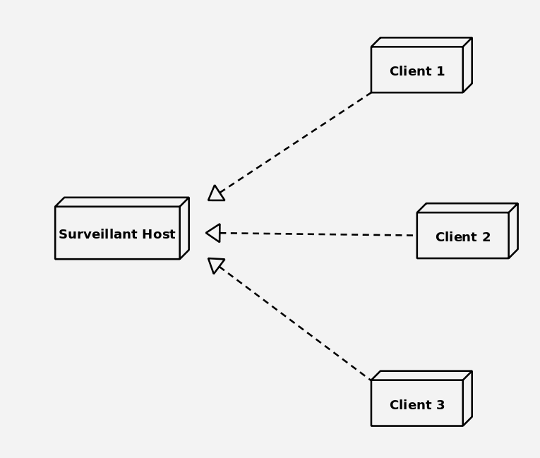

# Surveillant
**A highly customizeable dashboard on your desktop**

The surveillant project is an ambitious idea to make an 
all in one system mangement utility, that is compact enough
to fit on your desktop.

the principle of the project to have a dedicated monitoring
that can operate independant of your actual system, as well 
as act like a middleman when you need to interact with it as well

the project has 2 parts to it, mainly the physical 
dashboard as seen above, as well as the software 
which can be customized to run on other modified platforms

for my usage I built it with a khadas's VIM3 and their TS050 touchscreen
and the enclosure which is a customized version of a handheld case
which is 3D printed 

> Rendered version of the 3D printed case

> Disassembled construction

> completely assembled construction

now the software framework for this project is based on the 
principle of sending the data collected over the local network
for displaying on the dashboard

 
> multi client and host system

the system of having a dedicated server and client is more efficient
that previous methods of data collection, which involved more
heavy services like mpich to collect and send the data which
was quite bulky

this newer system has minimal system load and can be considered to have
negligible resource usage during run time.

> 0% cpu usage during idle and still fetching data, efficent!

This client can be ported to other platforms with ease, I've documented
the requirements for building a custom client in the github documentation
so if you require a modified version of the client server, its possible
to create one from scratch!

the project is completely open source and available on github to download
and try out!

check it out at [zephyrlabs/surveillant](https://github.com/ZephyrLabs/surveillant)